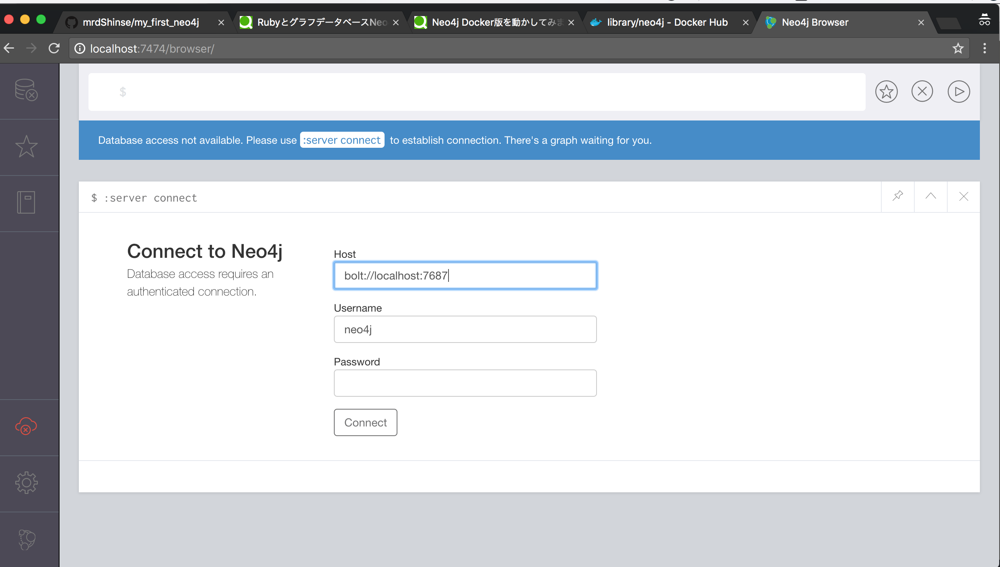

# 初めてのneo4j

## Dockerイメージを動かしてみる

```bash
docker run --detach --publish=7474:7474 --publish=7687:7687 neo4j:3.4.1
curl -I http://localhost:7474
# HTTP/1.1 200 OK
# Date: Sat, 14 Jul 2018 07:52:57 GMT
# Access-Control-Allow-Origin: *
# Content-Type: application/json;charset=utf-8
# Content-Length: 136
```

### SS


> 初期パスワードはneo4j

### Dockerfile

[hub.docker.com](https://hub.docker.com/_/neo4j/)

## 参考資料
[Neo4j Docker版を動かしてみました](https://qiita.com/awk256/items/305fd52c881d8df69de1)
